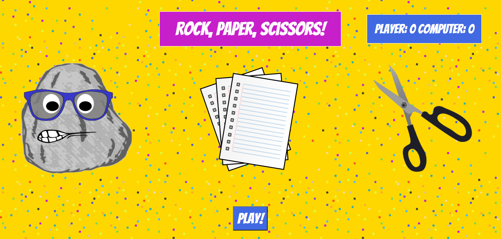

# Rock, Paper, Scissors

###### September 2020

_I've just refactored this game so that all interactions are now through HTML elements using the DOM rather than with `prompt()`, `alert()` and `confirm()`. I also seperated the CSS out into it's own file and refactored the styling to use flexblox instead of grid._

###### April 2020

_This was the first game I made and my first bigger project using JavaScript! I needed quite a bit of help at each step of the game creation but it was a super helpful learning curve and taught me how to go about planning and creating a game / app. I feel much more confident approaching new projects after this._

### Main Learning Points:

- I learnt about the importance of planning and pseudo code which really helped when I was thinking about all the possible game outcomes and scores. I learnt that it's important to spend time getting this right / clear at the beginning as then it's much easier to actually do the coding.
- It made me think about the flow of a game and in which order things need to happen (which I had taken for granted when playing other games). It really helped me to start thinking about processes and functionality on a deeper level which, being new to coding and game creation, I'd not had to do much before.
- I learnt about refactoring and why this was important. With some help I refactored my own code to make it cleaner and more efficient.
- I had lots more practice interacting with the DOM - using window.promt to ask for the users name, putting their name on the scoreboard, then updating the scoreboard after each turn, etc.
- I used Math.random() and Math.floor() to generate a number between 1 and 3 which in turn determined whether the computer played rock, paper or scissors.
- I got really confident using if and else statements in functions.
- I had a go at using CSS grid to layout the page.
